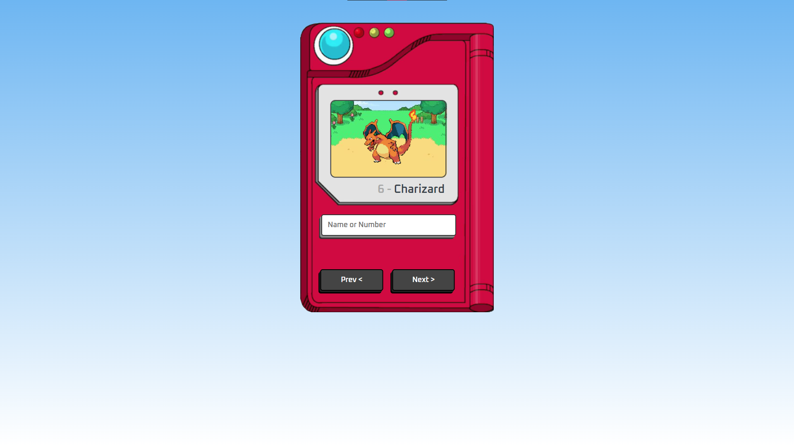

# Pokédex 

Esta aplicação Pokédex é uma plataforma desenvolvida para fornecer informações instantâneas e visuais sobre os Pokémon. Através de uma API integrada, o site busca os dados necessários, incluindo imagens, nomes e números de cada Pokémon, apresentando-os em um formato intuitivo e de fácil navegação, permitindo aos usuários explorar e aprender sobre os Pokémon de forma prática e visualmente atraente.

## 🚀 Demonstração

[Clique aqui](linkaqui) para acessar o resultado final do projeto.

## 🛠️ Tecnologias Utilizadas

* [HTML](https://developer.mozilla.org/pt-BR/docs/Web/HTML) - Linguagem de Marcação
* [CSS](https://developer.mozilla.org/pt-BR/docs/Web/CSS) - Linguagem de Estilização
* [Javascript](https://developer.mozilla.org/pt-BR/docs/Web/JavaScript) - Linguagem de Programação

## 👨‍💻 Desenvolvedor

    
    
&nbsp&nbsp&nbspFlávio Mattos 
    &nbsp&nbsp&nbsp<a href="https://www.instagram.com/fflaviomattos/">Instagram</a>&nbsp;|&nbsp;<a href="https://github.com/FlavioMattosDev">GitHub</a>&nbsp;|&nbsp;<a href="https://www.linkedin.com/in/flavio-mattos/">LinkedIn</a>&nbsp;

  

---
